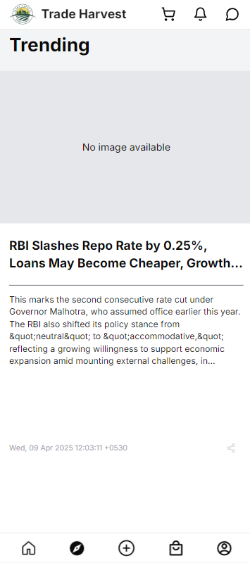

# 🌾 Trade Harvest

**Trade Harvest** is an AI-powered agri-marketplace platform enabling farmers and buyers to connect directly, access real-time prices, and analyze market trends. From predictive pricing to listing produce, Trade Harvest simplifies the farm-to-market journey.

---

## 📸 Screenshots

### 🔹 Home Page


### 🔹 Trending Agri News


### 🔹 Other Screenshots


---

## 🔧 Tech Stack

- **Frontend**: Next.js 14 (App Router), Tailwind CSS, TypeScript
- **Backend**: Flask, REST APIs, Selenium (Agmarknet scraping), ML prediction
- **Database**: SQLite (Dev), Supabase (Cloud Auth & Storage)
- **ML**: RandomForestRegressor, PCA, Mutual Info Selection
- **Authentication**: Supabase Auth
- **Charts/UI**: Recharts, ShadCN UI, Lucide Icons

---

## 📁 Folder Structure


---

## 🚀 Getting Started

### 1. Clone the Repository

```bash
git clone https://github.com/yomit15/TradeHarvest.git
cd TradeHarvest
```

### 2. Install Dependencies
```bash
npm install
```

### 3. Start the development server
```bash
npm run dev
```

- Visit http://localhost:3000 to view the app.

# ⚙️ Backend Setup
- The backend runs on Flask and serves:
  -- Price prediction API
  -- Agmarknet scraping via Selenium
  -- Real-time market & news data
- Navigate to the backend folder and run:
```bash
python app.py
```
- Ensure requirements.txt is set up with:
```txt
Flask
pandas
scikit-learn
selenium
beautifulsoup4
```

# 🧠 ML Features
Predict modal prices using trained RandomForestRegressor

Preprocessing pipeline includes imputation, encoding, scaling, PCA

Generates .pkl files for trained models

Supports auto feature selection & column selection

# 🗃️ Database Integration
Product names, categories, states, and cities are pulled from a connected DB

Supabase is used for authentication and file storage

SQLite used for local development

# 📦 Build for Production
```bash
npm run build
npm start
```

# 🤝 Contributing
-Contributions are welcome! Please:
-Fork the repo
-Create a new branch (git checkout -b feature-name)
-Commit your changes (git commit -m 'feat: add feature')
-Push to the branch (git push origin feature-name)
-Open a pull request

# 📄 License
This project is licensed under the MIT License.

# ✨ Credits
Developed by **Team Astrive**
Powered by OpenAI, Supabase, Agmarknet, and the open source community


